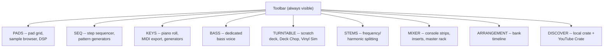

# Usage

The plugin has nine tabs, switched via the buttons in the toolbar strip
(top-left, next to the preset controls): **PADS**, **STEMS**, **TURNTABLE**,
**KEYS**, **SEQ**, **DISCOVER**, **ARRANGE**, **BASS**, and **MIXER**. The
preset bar and output meter stay visible on every tab, and a **< Back**
button next to them walks back through your last few tab switches. The
banner shows the installed version number (e.g. `v1.123.0`) directly under
the plugin name — check it before reporting a bug, since the
fix you're looking for might already be in a newer build.

This guide is split by feature area — pick where you want to start:

- [The toolbar](usage/modules/toolbar/toolbar-and-presets.md) — presets,
  transport, undo/redo, Pad Quantize, Mono/Limiter, MIDI Out, window sizing,
  metering, tabs
- **PADS tab**
  - [The pad grid & sample browser](usage/modules/pads/pad-grid-and-browser.md)
  - [Sample editor](usage/modules/sample-editor/sample-editor.md) — waveform, zoom, trim, chop
  - [DSP controls & output routing](usage/modules/dsp-controls/dsp-controls.md) — filter,
    envelope, pitch, FX
- [SEQ tab](usage/modules/step-sequencer/step-sequencer-and-roll.md) — the step
  sequencer, Roll/note-repeat, and pattern generators
- [STEMS tab](usage/modules/stems/stems-tab.md) — band/HPSS splitting, pre-mix levels,
  live preview
- [TURNTABLE tab](usage/modules/turntable/turntable-tab.md) — scratch deck, Deck Chop
  (chop a record straight onto pads), Vinyl Sim
- [KEYS tab](usage/modules/keys/keys-tab.md) — piano roll, MIDI export/import,
  chord/melody/full-pattern generators
- [DISCOVER tab](usage/modules/discover/discover-tab.md) — local crate browser + YouTube
  Crate
- [ARRANGEMENT tab](usage/modules/arrangement/arrangement-tab.md) — bank timeline with
  next-action control
- [BASS tab](usage/modules/bass/bass-tab.md) — dedicated bass voice with glide
- [MIXER tab](usage/modules/mixer/mixer-tab.md) — console-style strips for every
  sound source, insert effects, master rack
- [MIDI Learn](usage/modules/midi/midi-learn.md)
- [Saving your work & running standalone](usage/saving-and-standalone.md)
