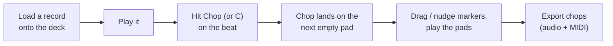
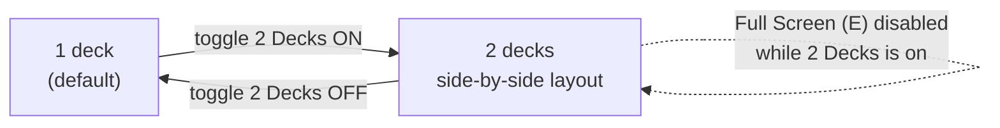

[&larr; Back to Usage overview](../../../USAGE.md) | [INSTALL](../../../INSTALL.md) | [LICENSE](../../../LICENSE.md) | [CHANGELOG](../../../CHANGELOG.md)

# TURNTABLE tab

One dedicated deck with its own sample slot, not tied to pad selection.
The platter sits on the left at a much larger size than other tabs'
controls; everything else lives in a scrollable strip on the right, and
the **Chop** lane runs along the bottom (see [Deck Chop](#deck-chop)
below): it chops whatever's on the deck straight onto your pads.

- **Full Screen** (or press **E**) — hides everything but the platter
  and a small Play/Cue strip, for an uncluttered view while performing.
  Press **Escape**, or click the button again, to return.

- **Load...** or **drag an audio file** onto the panel to load a sample
  onto the deck.
- **Click-drag the platter** to scratch: dragging clockwise plays forward,
  counter-clockwise reverses, and the pitch follows how fast you drag.
  Release to resume normal playback from wherever the scratch left off.
- **Play / Pause** — normal playback at the current pitch.
- **Cue** — stops and jumps back to the start.
- **Pitch** fader — 0.5x–2.0x playback speed when not scratching.
- **Volume** fader — deck output level.
- **EQ / Filter / Reverb** — Low/Mid/High EQ (±24dB), a Filter knob
  (sweeps low-pass to high-pass through a neutral centre), and a Reverb
  send, all real host-automatable parameters.
- **Loop** — repeats a beat-length region from wherever playback
  currently is (needs a detected BPM, see the BPM/Key readout).
- **Stutter** — hold-to-engage rapid retrigger of a short slice, rate
  selectable (1/4 to 1/32).
- **Scratch Patterns** — Baby/Scribble/Chirp/Transform presets replay a
  canned scratch gesture; **Record** captures your own platter moves as a
  named custom pattern to replay later.
- **Vinyl Sim** — Wow/Flutter, Vinyl Noise, and Saturation knobs (0–100%,
  no effect at 0) plus a **Motor Ramp** toggle (spins up to speed from a
  stop instead of starting instantly). All off by default.

The platter also responds to an external MIDI jog-wheel controller, not
just mouse drag: Note On/Off at note 20 touches/releases the platter, and
CC 20 carries relative jog motion (the standard sign-magnitude relative-
encoder convention most DJ jog wheels already speak) — both on MIDI
channel 1. Useful if you're driving this from a hardware controller or a
DAW MIDI script rather than the mouse.

## Deck Chop

Chop a record the way you'd do it on hardware: put it on the deck, play
it, and hit a button on the beat. Every chop lands on a pad straight away
and is playable immediately. There's no separate "commit" step, because
the markers on the waveform **are** the pads: move a marker and its pad
changes with it.

- **Chop** (or press **C**) — drops a chop at the playhead onto the
  lowest-numbered empty pad of the current bank. Works while the record
  plays (chop by ear) or while it's paused (chop exactly where you
  stopped). **Double-click** anywhere on the waveform to chop at that
  point instead.
- **The mini pad grid** (right of the waveform) shows the current bank:
  gold pads are chops of this record, grey pads hold other samples. Tap an
  **empty** pad to chop onto that exact pad at the playhead; tap any other
  pad to play it.
- **Markers** — each chop is a numbered flag; the number is its pad.
  Click a flag to hear the pad, **drag** it to move the chop, or select
  it and press **Left/Right** to nudge it 10ms (hold **Shift** for 1ms).
  **Delete** (or right-click → Delete) removes the chop and empties its
  pad. Every one of these is undoable with **Ctrl+Z**.
- **Gate** (on by default) — each chop stops where the next one starts,
  so every pad is its own clean slice. Turn it off to let chops play on
  to the end of the record, e.g. to start a longer phrase from a pad.
- **Snap** — Off, 1/4, 1/8 or 1/16: chops land on the record's beat grid,
  worked out from its detected BPM and lined up on your first chop (so the
  first chop is where you say the beat is; the grid follows from there).
  The grid shows on the waveform while Snap is on (zoom in if it's too
  dense to draw).
- **1/2** and **x2** — tempo detectors often read a record at double or
  half its real tempo (a 94 BPM record read as 188). Fix it here; the
  deck's Sync and Loop use the corrected tempo too, and it's saved with
  your project.
- **Offset** — if your by-ear chops keep landing a hair late (you hear
  the beat a few milliseconds after it plays), pull this negative. It
  only applies to chops taken while the record is playing. Double-click
  to reset to 0.
- **Tap Pads** (off by default) — when on, hitting an **empty** pad on the
  PADS tab or on your MIDI controller while the deck plays lays a chop on
  that pad, right then. Leave it off if a DAW MIDI clip plays the pads
  while the deck runs, or that clip would lay chops too.
- **Stretch** — time-stretches every chop pad to your project's tempo
  without changing its pitch, and follows the tempo if it changes. Needs
  the record's BPM (fix it with 1/2 / x2 first if it's wrong).
- **-**, **Fit**, **+** zoom the waveform (or **Ctrl + mouse wheel**; the
  wheel on its own scrolls). While the record plays, the view follows the
  playhead.
- **Export...** — pick a folder and you get one audio file per chop,
  numbered in record order with its pad in the name, plus a MIDI file
  that plays the chops back on the pads in their original order and
  timing. Drag both into your DAW.
- **Clear** — removes every chop of this record from the current bank
  (Ctrl+Z brings them back).

Good to know:

- Chops go into the **current bank** only. A 4x4 bank holds 16 chops;
  pick a bigger grid on the PADS tab (up to 8x8) for up to 64, or switch
  bank and keep chopping.
- Chop never overwrites a pad that already holds a sample: when the bank
  is full it tells you instead.
- Loading a different record onto the deck leaves your existing chops on
  their pads, fully playable; they just stop being editable markers.
- Chops are ordinary pads everywhere else: sequence them on SEQ, shape
  them with DSP, mix them on MIXER. Your project saves them like any
  other pad, and they come back as editable chops.
- Only deck 1 has the Chop lane. In **Full Screen** the lane hides, but
  **C** still chops.

## 2 Decks

Toggle **2 Decks** (top of the tab) to bring in a second, fully
independent deck — its own sample slot, platter, EQ/Filter/Reverb,
Vinyl Sim, scratch patterns, and MIDI Learn mappings, running alongside
the first. Everything documented above applies identically to both;
they don't share state or interact with each other beyond both being
audible at once.

- With 2 Decks on, the platters split **left/right** instead of one
  platter filling the space — each half is a complete, independent deck.
- **Full Screen is unavailable while 2 Decks is on** (there'd be two
  platters competing for the same full-screen space) — turn 2 Decks off
  first if you want the single-deck Full Screen view.
- Turning 2 Decks off doesn't unload or reset deck 2 — it's just hidden;
  turn it back on and deck 2 is exactly where you left it.
- Deck 2's sample, settings, and MIDI Learn mappings are saved with your
  project/preset the same as deck 1's.
